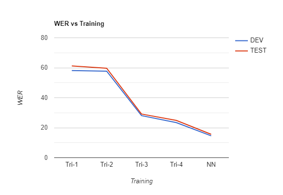
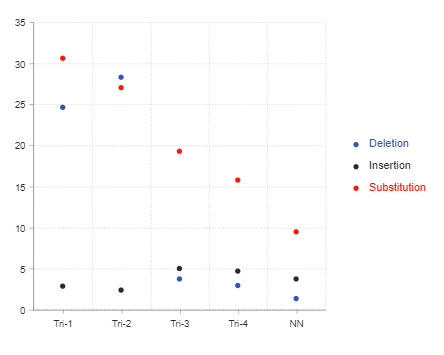
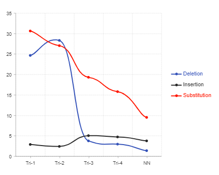

# Automatic Speech Recognition (ASR) - German

_This is my [Google Summer of Code 2019](https://summerofcode.withgoogle.com/projects/#5623384702976000) Project with the [Distributed Little Red Hen Lab](http://www.redhenlab.org/)._

This project aims to develop a working Speech to Text module using [Kaldi](http://www.kaldi-asr.org/) for the Red Hen Lab’s current Audio processing pipeline. This system will be used to transcribe the Television news broadcast captured by Red Hen in Germany.

## TODOLIST

- [x] Set up Kaldi
- [x] Data Preparation
- [x] Feature Exraction
- [x] Language Modelling
- [x] Phoneme Modelling
- [x] Acoustic Modelling
- [x] Training
- [x] Creating Singularity
- [x] Running on HPC and Creating German Speech Pipeline
- [x] Presentation + Demo
- [x] Documentation

## Important Links:

**Blog:** https://aashishag.github.io/blog/

**Website:** https://aashishag.github.io/asr-german/

**Demo:** https://drive.google.com/file/d/1J518NcretD8Kt7GlLWXCuZWPXdbuLTCg/view?usp=sharing

**Final Report (PPT):** https://drive.google.com/file/d/1yPUp0C_nsBfE8ixeWydiBTLcpHxjaTUe/view?usp=sharing

This Readme will be updated regularly to include information about the code and guidelines to use this software.

## Contents

1. [Getting Started](#getting-started)
2. [Data-Preprocessing for Training](#data-preprocessing-for-training)
3. [Training](#training)
4. [Some Training Results](#some-training-results)
5. [Running code at Case HPC](#running-code-at-case-hpc)
6. [Acknowledgments](#acknowledgments)

## Getting Started

### Prerequisites

* **Libraries**:

	* [Automake](https://packages.ubuntu.com/xenial/automake)
	* [Autoconf](https://packages.ubuntu.com/xenial/autoconf)
	* [Sox](http://manpages.ubuntu.com/manpages/bionic/man1/sox.1.html)
	* [Python](https://www.python.org/)	
	* [Libtool](https://www.gnu.org/software/libtool/)	
	* [Gfortran](https://gcc.gnu.org/wiki/GFortran)	
	* [Libgstreamer](https://packages.debian.org/sid/libgstreamer1.0-0)	


* **Graphics Processing Unit (GPU)**:

	* [Cuda](https://developer.nvidia.com/cuda-zone)

* **SWIG**:

	* [Swig](https://github.com/swig/swig)
	
* **Grapheme-to-Phoneme**:

	* [Sequitur-G2P](https://github.com/sequitur-g2p/sequitur-g2p)

* **Kaldi**:

	* [Numpy](https://www.numpy.org/)
	* [Beautifulsoup4](https://pypi.org/project/beautifulsoup4/)
	* [LXml](https://pypi.org/project/lxml/)
	* [Requests](https://pypi.org/project/requests/)
	* [Tornado](https://www.tornadoweb.org/en/stable/)
	* [Kaldi Gstreamer Server](https://github.com/alumae/kaldi-gstreamer-server)

* **Singularity**:

	* [Singularity](https://singularity.lbl.gov/)
	
### Installation

* **Libraries**:
	
	```bash
	$ sudo apt-get update
	```
	
	**_NOTE_**:
	_The other important libraries are downloaded in the later steps._
	
* **Graphics Processing Unit (GPU)**:

    * _Ubuntu 16.04_
	
	
	
	```bash
	$ sudo apt-get install linux-headers-$(uname -r)
	$ wget https://developer.nvidia.com/compute/cuda/10.1/Prod/local_installers/cuda-repo-ubuntu1604-10-1-local-10.1.168-418.67_1.0-1_amd64.deb
	$ sudo dpkg -i cuda-repo-ubuntu1604-10-1-local-10.1.168-418.67_1.0-1_amd64.deb
	$ sudo apt-key add /var/cuda-repo-<version>/7fa2af80.pub
	$ sudo apt-key add /var/cuda-repo-10-1-local-10.1.168-418.67/7fa2af80.pub
	$ sudo apt-get update
	$ sudo apt-get install cuda
	```
	
	The above installation is for _Ubuntu 16.04_. Refer below links for other versions.
	
	* [_Cuda-Installation-Guide-Linux_](https://docs.nvidia.com/cuda/cuda-installation-guide-linux/index.html)
	
	* [_Cuda-Downloads_](https://developer.nvidia.com/cuda-downloads)

* **Kaldi**:
	
	**._STEP 1:_**

	```bash
	$ git clone https://github.com/kaldi-asr/kaldi.git kaldi-trunk --origin golden
	$ cd kaldi-trunk
	```
	
	**_STEP 2:_**

	```bash
	$ cd egs
	$ git clone https://github.com/AASHISHAG/asr-german.git
	$ cd asr-german
	$ xargs -a linux_requirements.txt sudo apt-get install
	$ pip3 install -r requirements.txt
	$ pip install -r requirements.txt
	```
	
	**_STEP 3:_**

	```bash
	$ cd ../../tools
	$ sudo extras/install_mkl.sh
	$ sudo extras/install_irstlm.sh
	$ sudo extras/check_dependencies.sh
	$ sudo make USE_THREAD=0 FC=gfortran -j `nproc`
	```
	
	**_IGNORE ERROR/WARNINGS_**:
	1. _IRSTLM is not installed by default anymore. If you need IRSTLM Warning: use the script extras/install_irstlm.sh_
	2. _Please source the tools/extras/env.sh in your path.sh to enable it._
	
	**_STEP 4:_**

	```bash
	$ wget http://github.com/xianyi/OpenBLAS/archive/v0.2.18.tar.gz
	$ tar -xzvf v0.2.18.tar.gz
	$ cd OpenBLAS-0.2.18
	$ make BINARY=64 FC=gfortran USE_THREAD=0
	$ sudo mkdir /opt/openblas_st
	$ sudo make PREFIX=/opt/openblas_st install	
	```
	
	**_STEP 5:_**

	```bash
	$ cd ../../src
	$ sudo ./configure --use-cuda --cudatk-dir=/usr/local/cuda/ --cuda-arch=-arch=sm_70 --shared --static-math=yes --mathlib=OPENBLAS --openblas-root=/opt/openblas_st/
	$ sudo extras/install_irstlm.sh
	$ make -j clean depend `nproc`
	$ make -j `nproc`
	```

	**_STEP 6:_**

	```bash
	$ export KALDI_ROOT= <path to KALDI_ROOT>
	$ cd $KALDI_ROOT/tools/
	$ git clone https://github.com/alumae/gst-kaldi-nnet2-online
	$ cd gst-kaldi-nnet2-online/src
	$ make -j clean depend `nproc`
	$ make -j `nproc`
	```
	
	**_You can now test if the GST-Kaldi-NNET2-Online installation works:_**
	
	```bash
	$ GST_PLUGIN_PATH=$KALDI_ROOT/tools/gst-kaldi-nnet2-online/src gst-inspect-1.0 kaldinnet2onlinedecoder
	```
	
	**_NOTE_**:
	The entire process can take **_4-5 hours_**, depending on the server configurations.
	
* **Swig**:	

    SWIG is a compiler that integrates C and C++ with languages including Perl, Python, Tcl, Ruby, PHP, Java, C#, D, Go, Lua, Octave, R, Scheme (Guile, MzScheme/Racket), Scilab, Ocaml. SWIG can also export its parse tree into XML.
	
	```bash
	$ wget https://netix.dl.sourceforge.net/project/swig/swig/swig-4.0.0/swig-4.0.0.tar.gz
	$ chmod 777 swig-4.0.0.tar.gz
	$ tar -xzvf swig-4.0.0.tar.gz
	$ cd swig-4.0.0/
	$ sudo ./configure --prefix=/home/swig-4.0.0
	$ sudo make -j `nproc`
	$ sudo make install
	$ sudo vim /etc/profile
	$ export SWIG_PATH=/home/swig-4.0.0
	$ export SWIG_PATH=/home/swig-4.0.0/bin
	$ export PATH=$SWIG_PATH:$PATH
	$ source /etc/profile
	$ swig -version
	```
	
* **Sequitur-G2P**:

	Sequitur G2P is a trainable data-driven Grapheme-to-Phoneme converter.
	
	```bash
	$ git clone https://github.com/sequitur-g2p/sequitur-g2p.git
	$ pip3 install git+https://github.com/sequitur-g2p/sequitur-g2p@master
	$ make -j `nproc`
	```
	
	**_NOTE_**:
	_Change Sequitur G2P path in $KALDI_ROOT/egs/asr-german/recipe_v2/cmd.sh_

* **Kaldi Gstreamer Server**:
	
	[Kaldi Gstreamer Server](https://github.com/alumae/kaldi-gstreamer-server) is a real-time full-duplex speech recognition server, based on the Kaldi toolkit and the GStreamer framework and implemented in Python.
	
	```bash
	$ cd $KALDI_ROOT/tools/
	$ git clone https://github.com/alumae/kaldi-gstreamer-server
	$ cd kaldi-gstreamer-server
	$ cp ../../egs/asr-german/kaldi_de.yaml .
	```
	**_NOTE:_** Specify the path of _final.mdl_, _mfcc.conf_, _HCLG.fst_ and _words.txt_ in _kaldi-de.yaml_ (after training).
	
	In general, these would be at the following path:
	
	_./exp/nnet3_cleaned/tri5/final.mdl_
	
	_./conf/mfcc.conf_
	
	_./exp/chain_cleaned/tdnn1f_2048_sp_bi/graph/HCLG.fst_
	
	_./exp/chain_cleaned/tdnn1f_2048_sp_bi/graph/words.txt_

	
## Data-Preprocessing for Training

The [official Kaldi's documentation](https://kaldi-asr.org/doc/data_prep.html) is the basis of a lot of this section. The pipeline can easily be extended for new data. The data should be placed in the following path.
	
``` bash
$KALDI_ROOT/egs/asr-german/recipe_v2/data/wav
```
	
The respective scripts for data preprocessing can be added at [_run.sh_](recipe_v2/run.sh#L47).

Preprocess data so that each clip contains information regarding the specifics of the audio files, transcripts, and speakers. Specifically, it will contain the following files:

 - **text**
 
   The _text_ file is essentially the utterance-by-utterance transcript of the corpus. This is a text file with the following format:
	
   ``` bash
   utt_id WORD1 WORD2 WORD3 WORD4 …
   ```
   
   utt_id = utterance ID

   Example text file:

   ``` bash
   0000000_0000000_103784-104188 Hundert siebenunddreißig wurde deutlich
   0000000_0000000_107130-109799 in mehrfacher Hinsicht von Interesse
   0000000_0000000_116470-116776 immer stärkerer Einflussnahme des Deutschen Reiches
   …
   0000000_0000000_129066-129587 Gründung des Großdeutschen Reiches
   0000000_0000000_129897-130409 in ihrer zweiten Sitzung das Gesetz
   ```

 - **segments**
   
   The _segments_ file contains the start and end time for each utterance in an audio file. This is a text file with the following format:

   ``` bash
   utt_id file_id start_time end_time
   ```
   
   utt_id = utterance ID
   file_id = file ID
   start_time = start time in seconds
   end_time = end time in seconds

   Example segments file:

   ``` bash
   0000000_0000000_103784-104188 0000000_0000000 1037.835 1041.880
   0000000_0000000_107130-109799 0000000_0000000 1071.295 1097.990
   0000000_0000000_116470-116776 0000000_0000000 1164.695 1167.760
   …
   0000000_0000000_129066-129587 0000000_0000000 1290.655 1295.870
   0000000_0000000_129897-130409 0000000_0000000 1298.975 1304.090
   ```
	
 - **wav.scp**
 
   _wav.scp_ contains the location for each of the audio files. If your audio files are already in wav format, use the following template:
	
   ``` bash
   file_id path/file
   ```
   Example wav.scp file:

   ``` bash
   b522038b-0e97-42c5-87a5-a95df5b38bcf_2014-03-20-13-13-27_d data/wav/german-speechdata-package-v2/train/2014-03-20-13-13-27_Yamaha.wav
   b522038b-0e97-42c5-87a5-a95df5b38bcf_2014-03-20-13-13-34_a data/wav/german-speechdata-package-v2/train/2014-03-20-13-13-34_Kinect-Beam.wav
   b522038b-0e97-42c5-87a5-a95df5b38bcf_2014-03-20-13-13-34_b data/wav/german-speechdata-package-v2/train/2014-03-20-13-13-34_Kinect-RAW.wav
   …
   b522038b-0e97-42c5-87a5-a95df5b38bcf_2014-03-20-13-13-34_d data/wav/german-speechdata-package-v2/train/2014-03-20-13-13-34_Yamaha.wav
   b522038b-0e97-42c5-87a5-a95df5b38bcf_2014-03-20-13-13-49_a data/wav/german-speechdata-package-v2/train/2014-03-20-13-13-49_Kinect-Beam.wav
   ```

   If your audio files are in a different format (sphere, mp3, flac, speex), you will have to convert them to wav format. The tool sox will come in handy in many of these cases. 
 
 - **utt2spk**
   
   _utt2spk_ contains the mapping of each utterance to its corresponding speaker. The concept of “speaker” does not have to be related to a person – it can be a room, accent, gender, or anything that could influence the recording. This definition of “speaker” then is left up to the modeler.

   utt2spk is a text file with the following format:

   ``` bash
   utt_id spkr
   ```
   
   utt_id = utterance ID
   spkr = speaker ID

   Example utt2spk file:

   ``` bash
   0000000_0000000_103784-104188 0000000
   0000000_0000000_107130-109799 0000000
   0000000_0000000_116470-116776 0000000
   …
   0000000_0000000_129066-129587 0000000
   0000000_0000000_129897-130409 0000000
   ```

 - **spk2utt**
 
   _spk2utt_ is a file that contains the speaker to utterance mapping. This information is already contained in utt2spk, but in the wrong format. The following line of code will automatically create the spk2utt file and simultaneously verify that all data files are present and in the correct format:

   ``` bash
   utils/fix_data_dir.sh data/train
   ```
   While spk2utt has already been created, you can verify that it has the following format:

   ``` bash
   spkr utt_id1 utt_id2 utt_id3
   ```
   Example spk2utt file:
   
   ``` bash
   0000000 0000000_0000000_103784-104188 0000000_0000000_107130-109799 0000000_0000000_116470-116776
   0000000_0000000_129066-129587 0000000_0000000_129897-130409 0000000_0000000_131515-131982 0000000_0000000_132017-132451
   0000000_0000000_138839-139224 0000000_0000000_141927-142863 0000000_0000000_144840-145112 0000000_0000000_149113-149742
   …
   0000000_0000000_149860-150958 0000000_0000000_155252-155968 0000000_0000000_159837-160356 0000000_0000000_160517-160603
   0000000_0000000_160621-160844 0000000_0000000_160845-162643 0000000_0000000_162792-164380 0000000_0000000_164382-164717
   ```	
	

   The above steps are enough to train the model with new data. If necessary, the other stages of speech recognition can also be modeled at line:
	
	- [Phoneme](recipe_v2/run.sh#L80)
	
	- [Grapheme-to-Phoneme](recipe_v2/run.sh#L89)
	
	- [Language Modelling](recipe_v2/run.sh#L121)
	
	- [Feature Extraction - MFCC](recipe_v2/run.sh#L129)
	
	- [Acoustic Modelling](recipe_v2/run.sh#L161)
	
## Training

Firstly, change the server configurations at [cmd.sh](recipe_v2/cmd.sh)

   ``` bash
   export nJobs=28
   export nDecodeJobs=12
   ```

Finally, run the model on training.
   
   ``` bash
   $ cd $KALDI_ROOT/egs/asr-german/recipe_v2
   $ nohup ./run.sh &
   ```
	
**_NOTE:_** _The training would take a couple of days depending on the server configurations. It is recommended to run it in the background_.

## Some Training Results
Here are some of the results I obtained after training the model. The script [_recipe_v2/show_results.sh_](./recipe_v2/show_results.sh) was used to get these results. These results are based on _best_wer_ file generated by Kaldi.

**_Word Error Rate_ vs _Training Stages_**
<p align="center"></p>

**Percentage of _Deletion_, _Insertion_ and _Subsitution Error_ across different Training Stages**
 

``` bash
%WER 58.10 [ 38790 / 66768, 1903 ins, 16466 del, 20421 sub ] [PARTIAL] exp//tri1/decode_dev_nosp/wer_10_0.0
%WER 61.21 [ 42600 / 69600, 1981 ins, 18961 del, 21658 sub ] [PARTIAL] exp//tri1/decode_test_nosp/wer_10_0.0
%WER 57.75 [ 38560 / 66768, 1614 ins, 18899 del, 18047 sub ] [PARTIAL] exp//tri2/decode_dev_nosp/wer_10_0.0
%WER 59.67 [ 41528 / 69600, 2130 ins, 18606 del, 20792 sub ] [PARTIAL] exp//tri2/decode_test_nosp/wer_9_0.0
%WER 28.85 [ 19261 / 66768, 3215 ins, 2902 del, 13144 sub ] [PARTIAL] exp//tri3/decode_dev_nosp/wer_14_0.0
%WER 28.08 [ 18750 / 66768, 3345 ins, 2516 del, 12889 sub ] [PARTIAL] exp//tri3/decode_dev_pron/wer_13_0.5
%WER 29.56 [ 20572 / 69600, 3568 ins, 2894 del, 14110 sub ] [PARTIAL] exp//tri3/decode_test_nosp/wer_13_0.0
%WER 29.14 [ 20279 / 69600, 3557 ins, 2696 del, 14026 sub ] [PARTIAL] exp//tri3/decode_test_pron/wer_13_0.5
%WER 23.44 [ 15653 / 66768, 3164 ins, 1976 del, 10513 sub ] [PARTIAL] exp//tri4_cleaned/decode_dev/wer_14_0.5
%WER 31.36 [ 20941 / 66768, 3578 ins, 2911 del, 14452 sub ] [PARTIAL] exp//tri4_cleaned/decode_dev.si/wer_13_0.5
%WER 24.86 [ 17305 / 69600, 3544 ins, 1996 del, 11765 sub ] [PARTIAL] exp//tri4_cleaned/decode_test/wer_13_0.5
%WER 31.90 [ 22202 / 69600, 3858 ins, 2984 del, 15360 sub ] [PARTIAL] exp//tri4_cleaned/decode_test.si/wer_13_0.5
%WER 24.08 [ 16075 / 66768, 3463 ins, 1819 del, 10793 sub ] [PARTIAL] exp//tri4/decode_dev_pron/wer_14_0.5
%WER 35.20 [ 23504 / 66768, 4244 ins, 3034 del, 16226 sub ] [PARTIAL] exp//tri4/decode_dev_pron.si/wer_14_0.5
%WER 25.50 [ 17745 / 69600, 3879 ins, 1855 del, 12011 sub ] [PARTIAL] exp//tri4/decode_test_pron/wer_13_0.5
%WER 35.44 [ 24668 / 69600, 4759 ins, 2898 del, 17011 sub ] [PARTIAL] exp//tri4/decode_test_pron.si/wer_13_0.5
%WER 14.61 [ 9758 / 66768, 2517 ins, 884 del, 6357 sub ] [PARTIAL] exp//chain_cleaned/tdnn1f_2048_sp_bi/decode_dev/wer_12_1.0
%WER 15.62 [ 10871 / 69600, 2746 ins, 865 del, 7260 sub ] [PARTIAL] exp//chain_cleaned/tdnn1f_2048_sp_bi/decode_test/wer_11_1.0
```

**_Some Audio Clips and Results_**

**[DE_01_Male](https://aashishag.github.io/others/de_1.wav)**
``` bash
$ Actual: Gerrit erinnerte sich daran dass er einst einen Eid geschworen hatte
$ Output: Garrett erinnerte sich daran dass er einst einen Eid geschworen hatte
```

**[DE_02_Male](https://aashishag.github.io/others/de_2.wav)**
``` bash
$ Actual: Wenn man schnell fährt ist man von Emden nach Landshut nicht lange unterwegs
$ Output: Weil man schnell fährt ist man von Emden nach Landshut nicht lange unterwegs
```

**[DE_03_Male](https://aashishag.github.io/others/de_3.wav)**
``` bash
$ Actual: Valentin hat das Handtuch geworfen
$ Output: Valentin hat das Handtuch geworfen
```

**[DE_04_Male](https://aashishag.github.io/others/de_4.wav)**
``` bash
$ Actual: Auf das was jetzt kommt habe ich nämlich absolut keinen Bock
$ Output: Auf das was jetzt kommt habe ich nämlich absolut keinen Bock
```

**[DE_05_Male](https://aashishag.github.io/others/de_5.wav)**
``` bash
$ Actual: Ich könnte eine Mitfahrgelegenheit nach Schweinfurt anbieten
$ Output: Ich könnte eine Mitfahrgelegenheit nach Schweinfurt anbieten
```

**[DE_06_Male](https://aashishag.github.io/others/de_6.wav)**
``` bash
$ Actual: Man sollte den Länderfinanzausgleich durch einen Bundesligasoli ersetzen
$ Output: Man sollte den Länderfinanzausgleich durch ein Bundesliga Soli ersetzen
```

**[DE_07_Male](https://aashishag.github.io/others/de_7.wav)**
``` bash
$ Actual: Von Salzburg ist es doch nicht weit bis zum Chiemsee
$ Output: Von Salzburg ist es doch nicht weit Bistum Chiemsee
```

**[DE_08_Male](https://aashishag.github.io/others/de_8.wav)**
``` bash
$ Actual: Selbst für den erfahrensten Chirurgen ist der Tumor eine knifflige Herausforderung
$ Output: Selbst für den erfahrensten Chirurgen ist der Tumor eine knifflige raus Federung
```

**[DE_09_Male](https://aashishag.github.io/others/de_9.wav)**
``` bash
$ Actual: Folgende Lektüre kann ich ihnen zum Thema Kognitionspsychologie empfehlen
$ Output: Folgende Lektüre kann ich ihn zum Thema Kognitionspsychologie empfehlen
``` 

**[DE_10_Male](https://aashishag.github.io/others/de_10.wav)**
``` bash
$ Actual: Warum werden da keine strafrechtlichen Konsequenzen gezogen
$ Output: Warum werden da keine strafrechtlichen Konsequenzen gezogen
```

**[DE_11_Female](https://aashishag.github.io/others/de_11.wav)**
``` bash
$ Actual: Cedrik selbst wußte kein Sterbenswörtchen davon nie war etwas Derartiges in seiner Gegenwart auch nur erwähnt worden
$ Output: Drake selbst wusste kein Sterbenswörtchen davon nie war etwas Derartiges in seiner Gegenwart auch nur erwähnt worden
```

**[DE_12_Female](https://aashishag.github.io/others/de_12.wav)**
``` bash
$ Actual: Dann wachsen die Haselsträucher und die Kletterrosen so dicht an den Mauern, daß man vor lauter Grün nicht in die Fenster sehen kann, trotzdem sie ganz niedrig liegen
$ Output: Dann wachsen die Haselsträucher und die Kletterrosen so dicht an den Mauern dass man vor lauter grün nicht in die Fenster sehen kann. Dem sie ganz niedrig liegen.
```

**[DE_13_Female](https://aashishag.github.io/others/de_13.wav)**
``` bash
$ Actual: Durch das grüne Tal windet sich das murmelnde Flüßchen, aus allen Gärten und Baumhainen lugen die schmucken Landhäuser und locken die weißgedeckten Tische der freundlichen Wirte
$ Output: Durch das grüne Tal windet sich das murmelnde Flüsschen aus allen Gärten und Baumhainen Logen die schmucken Landhäuser und locken die weißgedeckten Tische der freundlichen Wirte
```

## Running code at Case HPC

The entire project setup is available at _/mnt/rds/redhen/gallina/home/axa1142/_ and can be directly used to run the model and reproduce the result. The project is implemented using Singularity, which is available at _Singularity Hub_ can be downloaded at HPC.

``` bash
$ module load singularity
$ singularity pull --name kaldi_de.sif shub://AASHISHAG1/test:kaldi
```

_**NOTE:** This step is shown just for documentation. The below scripts would do it automatically._

### Prerequisites

* Copy project's code in your directory.

``` bash
$ cp -R /mnt/rds/redhen/gallina/home/axa1142/ ./new-directory
```
	
### Running the code
	
* Run the server (_kaldi-gstreamer-server_)
	
``` bash
$ ./run-server.sh
```
	
* Run the worker (_kaldi-gstreamer-server_)
	
``` bash
$ ./run-worker.sh
```
	
* Transcribe an audio clip (_kaldi-gstreamer-server_)
	
``` bash
$ ./run-model.sh path_to_audio
```

_**NOTE:** Give the complete path from root._
	
* Transcribe Red Hen News dataset (_Continuous Speech_)
	
``` bash
$ ./run-model.slurm specify_the_number_of_days_from_the_current_date_the_model_should_transcribe
```

* Transcribe Red Hen News dataset (_Voice Activity Detection_)
	
``` bash
$ ./run-model-vad.slurm specify_the_number_of_days_from_the_current_date_the_model_should_transcribe
```

**_EXAMPLE:_** 
	
./run-model.slurm (_if model should transcribe today's news_)

./run-model-vad.slurm (_if model should transcribe today's news_)
	
./run-model.slurm 1 (_if model should transcribe yesterday's news_)

./run-model-vad.slurm 1 (_if model should transcribe yesterday's news_)
	
./run-model.slurm 2 (_if model should transcribe day before yesterday's news_)

./run-model-vad.slurm 2 (_if model should transcribe day before yesterday's news_)
	
### Results of Red Hen News Dataset

* This is a small excerpt from the Red Hen News Dataset. The MP4 files are programmatically converted to WAV and fed to Kaldi-Gstreamer-Server. The model output, i.e., the transcripts are further formatted to adopt [Red Hen's Data Format](https://sites.google.com/site/distributedlittleredhen/home/the-cognitive-core-research-topics-in-red-hen/red-hen-data-format#TOC-Audio-Pipeline-Tags).
	
**_Continuous Speech Transcript_**
	
``` bash	
TOP|20190817150002|2019-08-17_1500_DE_DasErste_Tagesschau
COL|Communication Studies Archive, UCLA
UID|29979bf0-c101-11e9-a5ab-3bdd627efb4b
DUR|00:09:54
VID|720x576|640x512
SRC|Osnabruck, Germany
CMT|Afternoon news
CC1|DEU 150
ASR_02|DE
20190817150009.960|20190817150013.720|CC1|Hier ist das Erste Deutsche Fernsehen mit der tagesschau.
ASR_02|2019-08-19 14:07|Source_Program=Kaldi,infer.sh|Source_Person=Aashish Agarwal|Codebook=Deutsch Speech to Text
20190817150014.280|20190817150024.280|ASR_02|In Ungarn den Änderungen in den Bodensee ist es jetzt den deutschen Fernsehsendern wie der Tagesschau. Sie im Studio Karolinen lernen. Meine Damen und Herren ich begrüße Sie zutage Schau. Die Tiere in Berlin findet oft hinter verschlossenen Türen statt an diesem Wochenende aber stehen viele Türen offen Politik wird dann zwar nicht gemacht aber die Bürger sind eingeladen sich über die Arbeit der Bundesregierung zu informieren das Kanzleramt Die Ministerien und das Bundes Presseamt bieten mehr als acht Hundert Veranstaltungen an das Motto in diesem Jahr Halle. Politik. Familienministerin ist heute mit den Kindern aufgestanden macht den Auftakt beim Tag der offenen Tür Demokratie Grundrechte das muss schon bei den kleinsten Thema sein Amt Kinder rechts Bus wissen Sie genau was sie von der Ministerin erwachten Brecht erbaut. <UNK> Gewalt freie entziehen. Das Recht eine Ausbildung zu machen das Recht das Thema des kennen zur Schule gehen kann wenn man Behinderungen hart und so dass man trotzdem gleichberechtigtes heranwachsen. Auch Religionen Kultur und Summers Heute spricht der Bürger die Politiker hören es zu Hallo Politik das Kanzleramt Lied ein und alle vierzehn Ministerien Lassen hinter die Kulissen schauen Andrang und Ausflüge auch in Europas größten danken den hat das Gesundheitsministerium aufstellen lassen die gesund. des Bürgers ist wichtig Aufklärung tut Not und auch die im <UNK> Quoten und so kann wer will sich gleich noch impfen lassen ehe bekommt die zweite Masern Impfung. Alles für Jens Sparten. Bürger fragen Politiker antworten der Finanzminister der auch es Pedell Chef werden will lässt sich auch vom Volk wenig entlocken und nichts zur Pacht nach innen Wahl zur Demokratie dazu dass man sich auch mit <UNK>. Nun Freunden guten spricht und Bambus sagt Wenn was zu sagen ist heute also der Vizekanzler Morgen dann die Kanzlerin. In der C die Ouvertüre über einen Parteiausschluss des früheren Verfassungsschutz Präsidenten Maßen diskutiert Die Vorsitzende Kramp Karrenbauer sagte den Zeitungen der Funke Mediengruppe sie sehe beimaßen keine Haltung die ihn mit der C die EU noch wirklich verbinde Allerdings gebe es hohe Hürden für einen Parteiausschluss Der sächsische Ministerpräsident. Kretschmer kritisierte die Überlegungen Man schließt er niemanden aus der C D U aus nur weil er unbequem sei maßen gilt als konservativer C die EU Politiker und Gegner von Merkels Flüchtlingspolitik. In Hongkong haben erneut Tausende Menschen für Freiheit und Demokratie demonstriert. Hirten vorwiegend Lehrer zum Sitz der umstrittenen Regierungschefin Lärm der Protest verlief friedlich Unterdessen trafen sich in einem Park der Metropole Tausender Gegendemonstranten mit chinesischen Fahnen die sich selbst die Beschützer Hongkongs nennen die Zentralregierung in Peking hatte zuletzt vor Unruhen gewarnt Einheiten der Bewohner. Volkspolizei sind seit Tagen in der DDR benachbarten chinesischen Staat Shannon Jenny stark zunimmt. Im Sudan ist nach langen Verhandlungen der Weg für eine Übergangsregierung frei Vertreter von Opposition und bislang regierende Militär Rat haben heute in der Hauptstadt Khartum ein Abkommen unterzeichnet das einen gemeinsamen Rat von Zivilisten und Militärangehörigen vorsieht Dieser soll etwas mehr als drei Jahre lang. Gießen Dann sollen Wahlen stattfinden. Der Sudan Bäume britische Kolonie und wurde neun Hundert sechsundfünfzig unabhängig politisch stabile Phasen gab es seitdem kaum mehrmals putschte sich das Militär an die Macht. Neun und achtzig der Staatsstreich durch Generalleutnant Baschir der später offiziell Präsident wird unterstützt wird er von Islamisten unter ihrem Einfluss verhängte Baschir ein Scharia Gesetz und verschärfte damit den Konflikt mit dem Süden des Landes in dem das Christentum und traditioneller Religionen verbreitet sind. In bei Schiras Zeit fällt auch der Ausbruch des Darfur Konflikts Regierungstreue Milizen gehen brutal gegen rebellierende Volksgruppen vor ein Hundert Punkt null null null werden getötet der Konflikt ist bis heute nicht gelöst. Internationale Strafgerichtshof verhängte Haftbefehle gegen Baschir unter anderem wegen Kriegsverbrechen und Völkermordes. <UNK> und elf wird der Südsudan unabhängig. Olga stürzt der Sudan in eine wirtschaftliche Krise die zuletzt in immer stärkere Proteste mündet. Dreißig Jahre nach seiner Machtübernahme wird bei schier aus den eigenen Reihen gestürzt die Kontrolle übernimmt ein Militärrat aus allen Landesteilen sind sie nach Khartum gereist um einen historischen Tag zu feiern. Teheran ist nun Geschichte Es beginnt eine neue Ära. De la Rey de kann ich endlich wieder frei durch atmen die den alles war sehr teuer lieferbaren verzweifelt. Zwei Unterschriften festlicher Rahmen und viele Prominente aus dem Ausland Vertreter von Opposition und Militär besiegeln das über Monate mühsam verhandelte Vertrags. Der souveräner Rat ist künftig höchstes Staatsorgan Opposition und Militärs entsenden jeweils fünf Vertreter den elften bestimmen beide einvernehmlich ein General führt zunächst den Vorsitz der Rat überwacht die Regierungsbildung die Opposition benennt den Premierminister. <UNK> Militär den Innen und Verteidigungsminister nach neununddreißig Monaten Gibt es Wahlen. Hara militärischer Gruppen sollen künftig der Armee unterstellt werden Sie haben Anfang Juni ein Protest kennt mit brutaler Gewalt aufgelöst das gab viele Tote eine schwere Bürde Nun soll ein neues Kapitel aufgeschlagen werden. Eine Reihe hoffen dass es mit dem Sudan jetzt aufwärts geht der weder stolzer von Saldanha im können die Waffen niederlegen Frieden schließen können. <UNK> und <UNK>. Für Millionen ist ist der Tag der Freiheit auch wenn auf dem Weg zur Demokratie Unwägbarkeiten bleiben. Der Kult Film Easy Rider hat ihn berühmt gemacht das erste große Roadmovie der Kinogeschichte Eine begeistert gefeiert der Rebellion gegen das U es Establishment der späten sechzig er Jahrgang Peter Fonda wurde damit zum Idol der Hippiebewegung jetzt ist der Schauspieler im Alter von neunundsiebzig Jahren gestorben Nach Angaben seiner. Amelia erlag er den Folgen einer Lungenkrebserkrankung. Diese Leute versuchte er die Freiheit und fand Drogen und Rock n Roll. Von der spielte an der Seite von Bernay Vorfahr vor fünfzig Jahren nicht nur eine Hauptrolle in Easy Rider Er schrieb auch am Drehbuch mit und produzierte. Abenteuerfilm und Gesellschaftskritik zugleich brachte Easy Rider Peter Fonda seine erste Oscar Nominierung ein und machte ihm früher Leinwand Legende die Schauspielerei hatte er in den Genen schon sein Vater Henry Fonda war ein Star auf seine Schwester Jane reüssierte in Hollywood die Mutter hatte sich das Leben genommen als Peter und Jane noch Kind. waren vielleicht auch deshalb lagen Peter Fonda melancholische Räume. Als Bienenzüchter Vietnam Veteranen kämpfte er in dem Film JuLis Gold gegen Kriegs Trauma und Einsamkeit. Hat im Erdreich ihre Einkäufe selbst. Ich mach das Schiff. Ich bin nur so durcheinander. Neun Dingen gegenüber neuen Gefühlen. Ein Menschen. Diese Rolle gewann Fonda dem Golden Globe siebenundzwanzig Jahre nach Easy Rider Kamm Becks wie diese sind selten in Hollywood. Es ist großartig zurück zu sein Gardens ruhige Weberei. Mit einem Stern auf dem Hollywood Boulevard wird er im Filmgeschäft unsterblich auch wenn er im Alter von neunundsiebzig Jahren den Kampf gegen den Lungenkrebs verliert seine Schwester Jane Fonda veröffentlichte eine Stellungnahme in seinen letzten Tagen hatte ich eine schöne Zeit mit ihm allein erging lachend davon. Die Wette Aussichten. Nun wechselnd bewölkt mit sonnigen Abschnitten später vom Südwesten bis in die Mitte Schauer Zum Teil Gewitter die sich Richtung Osten ausbreiten achtzehn bis dreiunddreißig Grad. Die Tagesschau meldet sich wieder um siebzehn Uhr fünfzig Ich wünsche Ihnen einen schönen Tag. Neben Vorlage oder die Sängerin der Banco Bena bei Vala Gong gab. Die Verpflichtung Gagat wahrlich Das ist die Wahl Haupterwerbsquelle verstehen war das sind rein auf dem Tappert Fella aller Verstehen Sie Spaß Marc Forster schmeißt Nepal. Von den ehrlich Brothers ist nur einer ehrlich. Daher habe ich bringe Isabel war Level Europäer These schwimmen. Verstehen Sie Spaß bei <UNK> aus Mallorca Heute und zwanzig Uhr fünfzehn im Ersten.
END|20190817150956|2019-08-17_1500_DE_DasErste_Tagesschau
```

**_Speech Transcript using Voice Activity Detection (VAD)_**

``` bash	
TOP|20190817150002|2019-08-17_1500_DE_DasErste_Tagesschau
COL|Communication Studies Archive, UCLA
UID|29979bf0-c101-11e9-a5ab-3bdd627efb4b
DUR|00:09:54
VID|720x576|640x512
SRC|Osnabruck, Germany
CMT|Afternoon news
CC1|DEU 150
ASR_02|DE
20190817150009.960|20190817150013.720|CC1|Hier ist das Erste Deutsche Fernsehen mit der tagesschau.
ASR_02|2019-08-22 12:37|Source_Program=Kaldi,infer.sh|Source_Person=Aashish Agarwal|Codebook=Deutsch Speech to Text
20190817150014.280|20190817150058.770|ASR_02|Indem der Bohrungen im <UNK> ist es die erste deutsche Fernsehen mit der Tagesschau. Nein. Die im Studio Karolinen Kanzler Guten Tag meine Damen und Herren ich begrüße Sie zutage Schau. In Berlin findet oft hinter verschlossenen Türen statt an diesem Wochenende aber stehen viele Türen offen Politik wird dann zwar nicht gemacht aber die Bürger sind eingeladen sich über die Arbeit der Bundesregierung zu informieren das Kanzleramt die Ministerien und das Bundes Presseamt bieten mehr als acht Hundert Veranstaltungen an das Motto in diesem Jahr Hallo. Teak.
20190817150058.770000|20190817150113.920|ASR_02|Die Familienministerin ist heute mit den Kindern aufgestanden macht den Auftakt beim Tag der offenen Tür Demokratie Grundrechte das muss schon bei den kleinsten Thema sein Amt Kinder rechts Bus wissen Sie genau was sie von der Ministerin erwachten.
20190817150113.920000|20190817150202.010|ASR_02|Recht auf <UNK>. Nun gewaltfreie Erziehung. In können das Recht eine Ausbildung zu machen nun das Recht das jedes Kind zur Schule gehen kann wenn man Behinderungen hart und so dass man trotzdem gleichberechtigtes heranwachsen. Auch Religionen Kultur und Summers Heute spricht der Bürger die Politiker hören es zu Hallo Politik das Kanzleramt Lied ein und alle vierzehn Ministerien Lassen hinter die Kulissen schauen Andrang und Ausflüge auch in Europas größten danken den hat das Gesundheitsministerium aufstellen lassen die gesund. <UNK> des Bürgers ist wichtig Aufklärung tut Not und auch die im <UNK> Quoten und so kann wer will sich gleich noch impfen lassen ehe bekommt die zweite Masern Impfung.
20190817150202.010000|20190817150226.490|ASR_02|Alles für Jens Partner. Bürger fragen Politiker antworten der Finanzminister der auch ist Pedell Chef werden will lässt sich auch vom Volk wenig entlocken und nichts zur Pacht nach innen Wahl zur Demokratie dazu dass man sich auch mit <UNK> <UNK>. Gut spricht und Bambus sagt Wenn was zu sagen. Deutsche <UNK> also der Vizekanzler Morgen dann die Kanzlerin.
20190817150226.490000|20190817150331.890|ASR_02|In der C die EU wird über einen Parteiausschluss des früheren Verfassungsschutz Präsidenten Maßen diskutiert Die Vorsitzende Kramp Karrenbauer sagte den Zeitungen der Funke Mediengruppe sie sehe beimaßen keine Haltung die ihn mit der C die EU noch wirklich verbinde Allerdings gebe es hohe Hürden für einen Parteiausschluss Der sächsische Ministerpräsident Kretschmer Kreta. Die Überlegungen Man schließt er niemanden aus der C D U aus nur weil er unbequem sei maßen gilt als konservativer C die EU Politiker und Gegner von Merkels Flüchtlingspolitik. In Hongkong haben erneut tausende Menschen für Freiheit und Demokratie demonstriert Heute marschierten vorwiegend Lehrer zum Sitz der umstrittenen Regierungschefin Lärm der Protest verlief friedlich Unterdessen trafen sich in einem Park der Metropole Tausender Gegendemonstranten mit chinesischen Fahnen die sich selbst die <UNK>. Dieser Hongkongs nennen die Zentralregierung in Peking hatte zuletzt vor Unruhen gewarnt Einheiten der bewaffneten Volkspolizei sind seit Tagen in der der benachbarten chinesischen Staat Chengguan stark zunimmt.
20190817150331.890000|20190817150354.390|ASR_02|Im Sudan ist nach langen Verhandlungen der Weg für eine Übergangsregierung frei Vertreter von Opposition und bislang regierende Militär Rat haben heute in der Hauptstadt Khartum ein Abkommen unterzeichnet das einen gemeinsamen Rat von Zivilisten und Militärangehörigen vorsieht Dieser soll etwas mehr als drei Jahre lang regieren. Sollen Wahlen stattfinden.
20190817150354.390000|20190817150413.860|ASR_02|Der Sudan war eine britische Kolonie und wurde neun Hundert sechsundfünfzig unabhängig politisch stabile Phasen gab es seitdem kaum mehrmals putschte sich das Militär an die Macht neun Hundert neunundachtzig der Staatsstreich durch Generalleutnant Baschir der später offiziell Präsident wird unterstützt wird davon Islamisten.
20190817150413.860000|20190817150423.970|ASR_02|Unter ihrem Einfluss verhängte Baschir ein Scharia Gesetz und verschärfte damit den Konflikt mit dem Süden des Landes in dem das Christentum und traditioneller Religionen verbreitet sind.
20190817150423.970000|20190817150443.350|ASR_02|In Baschir 's Zeit fällt auch der Ausbruch des Darfur Konflikts Regierungstreue Milizen gehen brutal gegen rebellierende Volksgruppen vor ein Hundert Punkt null null null werden getötet der Konflikt ist bis heute nicht gelöst. <UNK> Internationale Strafgerichtshof verhängte Haftbefehle gegen Baschir unter anderem wegen Kriegsverbrechen und Völkermordes.
20190817150443.350000|20190817150446.440|ASR_02|<UNK> zwei Tausend elf wird der Südsudan unabhängig.
20190817150446.440000|20190817150452.650|ASR_02|In der Folge stürzt der Sudan in eine wirtschaftliche Krise die zuletzt in immer stärkere Proteste mündet.
20190817150452.650000|20190817150512.090|ASR_02|Dreißig Jahre nach seiner Machtübernahme wird bei schier aus den eigenen Reihen gestürzt die Kontrolle übernimmt ein Militärrat. <UNK> allen Landesteilen sind sie nach Khartum gereist um einen historischen Tag zu feiern. <UNK> Rad ist nun Geschichte Es beginnt eine neue Ära.
20190817150512.090000|20190817150531.260|ASR_02|De la Rey kann ich endlich wieder frei durch atmen alles war sehr teuer lieferbaren verzweifelt. Zwei Unterschriften festlicher Rahmen und viele Prominente aus dem Ausland. Der von Opposition und Militär besiedeln das über Monate mühsam verhandelte Vertrags.
20190817150531.260000|20190817150554.510|ASR_02|Der souveräner Rat ist künftig höchstes Staatsorgan Opposition und Militärs entsenden jeweils fünf Vertreter den elften bestimmen beide einvernehmlich ein General führt zunächst den Vorsitz. <UNK> überwacht die Regierungsbildung die Opposition benennt den Premierminister das Militär den Innen und Verteidigungsminister.
20190817150554.510000|20190817150557.720|ASR_02|Nach neununddreißig Monaten Gibt es Wahlen.
20190817150557.720000|20190817150633.030|ASR_02|Hagar militärische Gruppen sollen künftig der Armee unterstellt werden Sie haben Anfang Juni ein Protest kennt mit brutaler Gewalt aufgelöste Ska viele Tote eine schwere Bürde Nun soll ein neues Kapitel aufgeschlagen werden. Wir hoffen dass es mit dem Sudan jetzt aufwärts geht weder stolzer von Saldanha im können die Waffen niederlegen Frieden schließen können. <UNK> und <UNK>. Für Millionen ist ist der Tag der Freiheit auch wenn auf dem Weg zur Demokratie Unwägbarkeiten bleiben.
20190817150633.030000|20190817150656.460|ASR_02|Der Kult Film ehe sie wieder hat ihn berühmt gemacht das erste große Roadmovie der Kinogeschichte Eine begeistert gefeiert der Rebellion gegen das U es Establishment der späten sechzig er Jahrgang Peter Fonda wurde damit zum Idol der Hippiebewegung jetzt ist der Schauspieler im Alter von neunundsiebzig Jahren gestorben Nach Angaben seiner Familie. <UNK> er den Folgen einer Lungenkrebserkrankung.
20190817150656.460000|20190817150759.670|ASR_02|Als Easy Rider suchte er die Freiheit und fand. Trotz der NRO. Peter Fonda spielte an der Seite von Dennis Hopper fünfzig Jahren nicht nur eine Hauptrolle in Easy Rider Er schrieb auch am Drehbuch mit und produzierte. Abenteuer Film und Gesellschaftskritik zugleich brachte Easy Rider Peter Fonda seine erste Oscar Nominierung ein und machte ihm früher Leinwand Legende die Schauspielerei hatte er in den Genen schon sein Vater Henry Fonda war einst dar auch seine Schwester Jane reüssierte in Hollywood die Mutter hatte sich das Leben genommen als Peter und Jane auch Kinder. Vielleicht auch deshalb lagen Peter Fonda melancholische Räume. Ins Bienenzüchter Vietnam Veteranen kämpfte er in dem Film Julies Gold gegen Kriegs Trauma und Einsamkeit. Hat in den Vertrag ihre Einkäufe selbst. Ich mach das Schiff. Ich bin nur so durcheinander. Wenn man sich neuen Dingen gegenüber verhält.
20190817150759.670000|20190817150801.200|ASR_02|Neuen Gefühlen.
20190817150801.200000|20190817150802.490|ASR_02|Ein Menschen.
20190817150802.490000|20190817150834.050|ASR_02|Für diese Rolle gewann von da den Golden Globe siebenundzwanzig Jahren nach Easy Rider Kamm Becks wie diese sind selten in Hollywood. Es ist großartig zurück zu sein Jahresberichte Weber. Mit einem Stern auf dem Hollywood Bulevar wird er im Filmgeschäft unsterblich auch wenn er im Alter von neunundsiebzig Jahren den Kampf gegen den Lungenkrebs verliert seine Schwester Jane Fonda veröffentlichte eine Stellungnahme in seinen letzten Tagen hatte ich eine schöne Zeit mit ihm allein erging lachend davon.
20190817150834.050000|20190817150846.620|ASR_02|Die Wette Aussichten Morgen wechselnd bewölkt mit sonnigen Abschnitten später vom Südwesten bis in die Mitte Schauer Zum Teil Gewitter die sich Richtung Osten ausbreiten achtzehn bis dreiunddreißig Grad.
20190817150846.620000|20190817150931.800|ASR_02|Die Tagesschau meldet sich wieder um siebzehn Uhr fünfzig Ich wünsche Ihnen einen schönen Tag. Neben Vorlage oder die Sängerin der Banco Bena bei Vala Gong gab. Verstehe gackerte wahrlich Das ist Hauptsache wirklich verstehen war. Der Rhein auf dem Tappert Fella aller Verstehen Sie Spaß Marc Forster schmeißen Gepard. Von den ehrlich Brothers ist nur einer ehrlich. Abel. Isabel war Level Europäer These schwimmen. Verstehen Sie Spaß Spezial aus Mallorca heute um zwanzig Uhr fünfzehn im Ersten.
20190817150931.800000|20190817150955.080|ASR_02|<UNK>.
END|20190817150956|2019-08-17_1500_DE_DasErste_Tagesschau
```
	
## Acknowledgments
* [Google Summer of Code 2019](https://summerofcode.withgoogle.com/)
* [Red Hen Lab](http://www.redhenlab.org/)
* [Kaldi](http://www.kaldi-asr.org)
* [Kaldi Help Group](https://groups.google.com/forum/#!forum/kaldi-help)
* [Singularity Help Group](https://groups.google.com/a/lbl.gov/forum/#!forum/singularity)